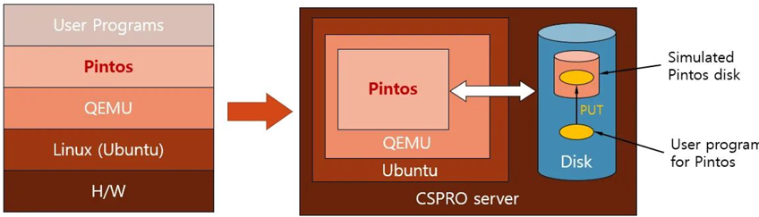
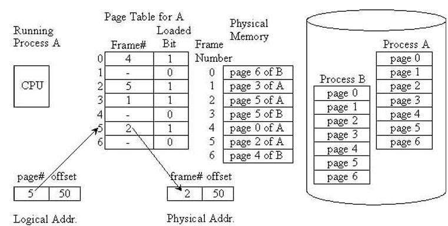

# Stanford Pintos Project
## Lab1: User program  

This project focus on implementing user program support in Pintos. The main tasks include argument passing, system call handling, and managing per-thread resources. We implemented `push_argument()` to correctly set up the user stack following x86 conventions, and extended the kernel to support essential system calls such as `exec`, `wait`, `read`, `write`, and file operations. Our work also introduced new data structures for process management, synchronization via semaphores, and safe memory access validation. Through this lab, we gained hands-on experience with OS internals including stack layout, process execution, and system call interfaces.
  
- Please check the full source code in [Pintos_lab1](./lab1_user_prog/pintos/) folder. 
- For more detail descriptions of our implementation and results please check [lab1_report](./lab1_user_prog/lab1_report.pdf).

## Lab2: Threads  
This project focus on three major components of thread management in Pintos: the alarm clock, priority scheduling, and the advanced scheduler. We implemented an efficient sleep mechanism to replace busy waiting, ensuring threads wake up correctly using a dedicated sleep list. To handle scheduling fairness, we added support for priority donation to resolve priority inversion and guarantee that high-priority threads acquire locks promptly. Finally, we extended the scheduler with the BSD-style Multi-Level Feedback Queue Scheduler (MLFQS), incorporating fixed-point arithmetic for priority and CPU usage calculations. Through this lab, we gained practical insights into synchronization, scheduling policies, and kernel-level concurrency control.
  
- Please check the full source code in [Pintos_lab2](./lab2_threads/pintos/) folder. 
- For more detail descriptions of our implementation and results please check [lab2_report](./lab2_threads/lab2_report.pdf).

## Lab3: Virtual Memory  

This project focus on virtual memory management in Pintos. We implemented a supplemental page table (SPT) and frame table to manage user pages, with support for page swapping, eviction, and memory-mapped files. Synchronization mechanisms such as frame locks, I/O condition variables, and swap space management were added to ensure safe concurrent access. Our design also supports automatic stack growth through heuristic checks on page faults. With these features, the kernel can handle demand paging, efficient frame allocation, and file-backed memory, passing all provided VM tests including the bonus cases.
  
- Please check the full source code in [Pintos_lab3](./lab3_virtual_memory/pintos/) folder. 
- For more detail descriptions of our implementation and results please check [lab3_report](./lab3_virtual_memory/lab3_report.pdf).